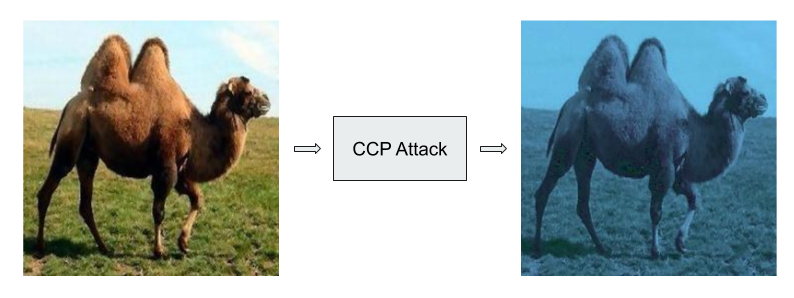

# Color Channel Perturbation Attack
A Stochastic Color Channel Based Attack to fool CNNs.

### CODE
This folder contains all the code related to Training and CCP attacks of CIFAR10, CALTECH256, TinayTmagenet datasets.  
